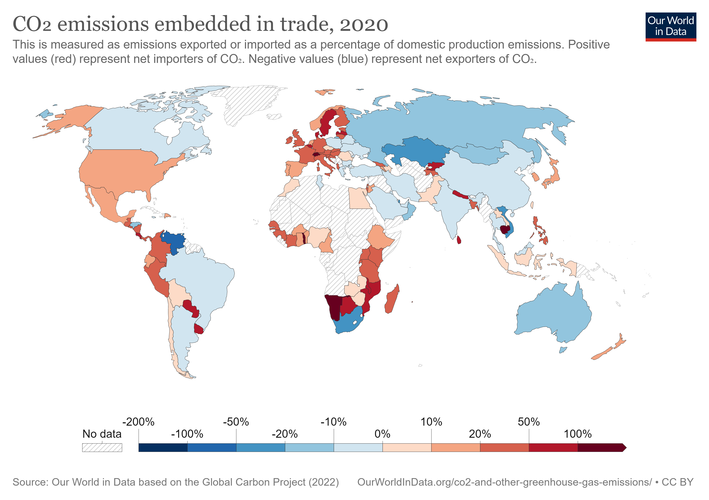

```{r setup, include=FALSE}
# figures formatting setup
options(htmltools.dir.version = FALSE)
library(knitr)
opts_chunk$set(
  prompt = T,
  fig.align="center", #fig.width=6, fig.height=4.5, 
  # out.width="748px", #out.length="520.75px",
  dpi=300, #fig.path='Figs/',
  cache=F, #echo=F, warning=F, message=F
  engine.opts = list(bash = "-l")
  )
### Next hook based on this SO answer: https://stackoverflow.com/a/39025054
knit_hooks$set(
  prompt = function(before, options, envir) {
    options(
      prompt = if (options$engine %in% c('sh','bash')) '$ ' else 'R> ',
      continue = if (options$engine %in% c('sh','bash')) '$ ' else '+ '
      )
})
library(tidyverse)
```


# Table of contents

<br>

1. [Research interest and motivation](#first)

2. [Useful definitions](#definitions)

3. [Trends](#trends)

4. [Implications: what is best for meeting Paris Agreement targets?](#implications)

5. [Limitations of this approach](#limitations)

6. [Questions](#questions)

7. [To sum up](#summary)

---
class: inverse, center, middle 
name: first

# Research interest and outlook 

<html><div style='float:left'></div><hr color='#EB811B' size=1px style="width:1000px; margin:auto;"/></html>


---


# Research interest and outlook  

.pull-left[
* We are interested in investigating the two most prominent methods for accounting greenhous gas emissions
* Currently, the allocation of responsibility is based on the production-based (PB) accounting method
* Many scholars promote an alternative accounting method as complementary: the consumption-based (CB) one. 

*WHY?* 
--
* In this presentation, we will focus on the differences between these two methods, analyse trends and implications and understand why it is important to have different perspectives when accounting for greenhouse gases

HINT: it has to do with responsibility! 
]

--
.pull-right-center[
<br><br>
<div align="center">
 
</div>
`Source` [Meme](https://the-memess.blogspot.com/2013/11/backstreet-boys-meme-tell-me-why.html)
]


---
class: inverse, center, middle 
name: definitions

# Definitions: PBA & CBA

<html><div style='float:left'></div><hr color='#EB811B' size=1px style="width:1000px; margin:auto;"/></html>


---

# Useful definitions

## Production-based accounting


* Measures emissions generated in the place where goods and services are produced
* Official accounting system used under the UNFCCC Framework
* Calculates emissions that are generated from the domestic production of goods and services irrespective of whether they are consumed domestically or are exported
* Sometimes called 'territorial'


## Consumption-based accounting

* Measures emissions produced by the final consumption of goods and services
* It is calculated by adding to production-based accounting (PBA) emissions generated to produce
imported goods and services and subtracting those associated with exported goods and services 
* PBE + Emissions (Import) - Emissions (Export)
* Accounts for **trade**

---

# Consumption-based accounting is relevant


.pull-left[
<br>
<div align="left">
 
</div>
`Credit` [OurWorldInData](https://ourworldindata.org/consumption-based-co2)
]

--
.pull-right[

## Lifestyles and globalisation

* In a globalised world, the transfer of carbon between regions, either physically or embodied in production, represents a substantial fraction of global carbon emissions.

* Emissions produced by international trade are constantly increasing 

* There are **emission importing** and **emission exporting** countries
]


---
class: inverse, center, middle 
name: trends

# Trends and differences

<html><div style='float:left'></div><hr color='#EB811B' size=1px style="width:1000px; margin:auto;"/></html>


---


# Trends and differences

## An overview of consumption vs. production emissions: 

.pull-left-center[
<br>
<div align="center">
 
</div>

]

.pull-right-center[
<br>
<div align="center">
 
</div>
]

Production-based emissions are wayyyy more! 
---

# Share of consumption and consumption by region 

.pull-left-center[
<br>
<div align="center">
 
</div>

]


.pull-right-center[
<br>
<div align="center">
 
</div>
]

---

# Consumption by country in the year 2018
.pull-left-center[
<br>
<div align="center">
 
</div>

]


.pull-right-center[
<br>
<div align="center">
 
</div>
]

---

# PUT PLOTLY HERE

---
class: inverse, center, middle 
name: implications

# Implications

<html><div style='float:left'></div><hr color='#EB811B' size=1px style="width:1000px; margin:auto;"/></html>


---

# Implications of accounting also for trade

- Bullet 1
- Bullet 2
- Bullet 3


---
class: inverse, center, middle 
name: limitations

# Opportunities and weaknesses

<html><div style='float:left'></div><hr color='#EB811B' size=1px style="width:1000px; margin:auto;"/></html>


---

# Opportunities and weaknesses of CB based approach

blbablbldj


---
class: inverse, center, middle 
name: questions

# What do you think? 

<html><div style='float:left'></div><hr color='#EB811B' size=1px style="width:1000px; margin:auto;"/></html>


---

# Q&A

* frame questions for the people
* put a meme


---
class: inverse, center, middle 
name: summary

# To sum up

<html><div style='float:left'></div><hr color='#EB811B' size=1px style="width:1000px; margin:auto;"/></html>


---

# Only if we have time


# References 

peters et al 2012

grasso 

(Afionis et al.)  

data: our world in data

Growth in emission transfers via international trade from 1990 to 2008
Glen P Peters 1, Jan C Minx, Christopher L Weber, Ottmar Edenhofer

Karakaya, E., Yılmaz, B. & Alataş, S. How production-based and consumption-based emissions accounting systems change climate policy analysis: the case of CO2 convergence. Environ Sci Pollut Res 26, 16682–16694 (2019). https://doi.org/10.1007/s11356-019-05007-2
